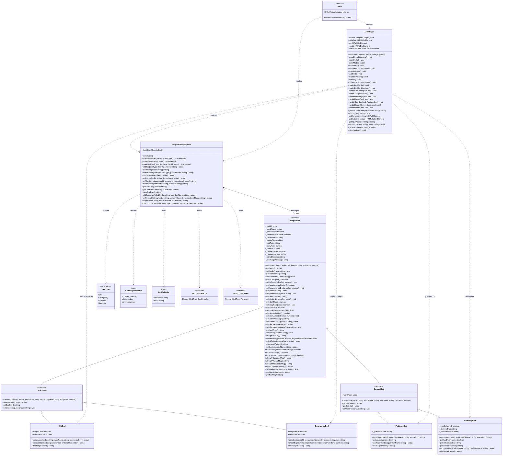

# UML Class Diagram

This diagram represents the current TypeScript classes in the Hospital Bed Patient Triage System.

## Visual Diagram

## Mermaid Diagram

## Relationship Summary

- `HospitalBed` is the abstract parent class for all beds and owns shared state for occupancy, doctors, billing, monitoring, admission, and discharge.
- `CriticalBed` and `GeneralBed` extend `HospitalBed` and provide shared behavior for critical-care and general-care bed families.
- `ICUBed` and `EmergencyBed` are critical bed types with specialized vital-sign checks.
- `PediatricBed` and `MaternityBed` are general bed types with guardian and delivery-record behavior.
- `HospitalTriageSystem` owns the bed list and coordinates admissions, discharges, bed creation/deletion, transfers, billing day simulation, doctor assignment, monitoring changes, and specialty workflows.
- `UIManager` connects browser controls to `HospitalTriageSystem` and renders bed cards.
- `main.ts` creates the system and UI manager, then runs the simulated daily billing timer.
