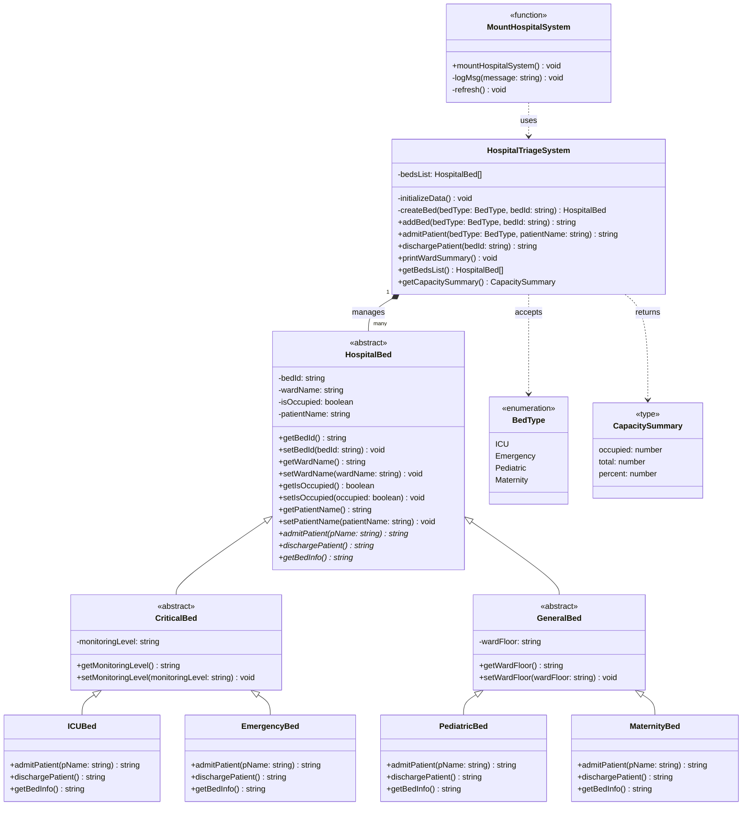

# UML Class Diagram

This diagram represents the main TypeScript classes in the Hospital Bed Patient Triage System.

## Visual Diagram

## Mermaid Diagram

## Relationship Summary

- `HospitalBed` is the abstract parent class for all beds.
- `CriticalBed` and `GeneralBed` extend `HospitalBed` and add specialized shared fields.
- `ICUBed` and `EmergencyBed` are critical bed types.
- `PediatricBed` and `MaternityBed` are general bed types.
- `HospitalTriageSystem` owns and manages the list of beds, including creating new bed objects through `addBed()`.
- `mountHospitalSystem()` connects the browser UI to `HospitalTriageSystem` without putting bed creation rules inside the HTML.
