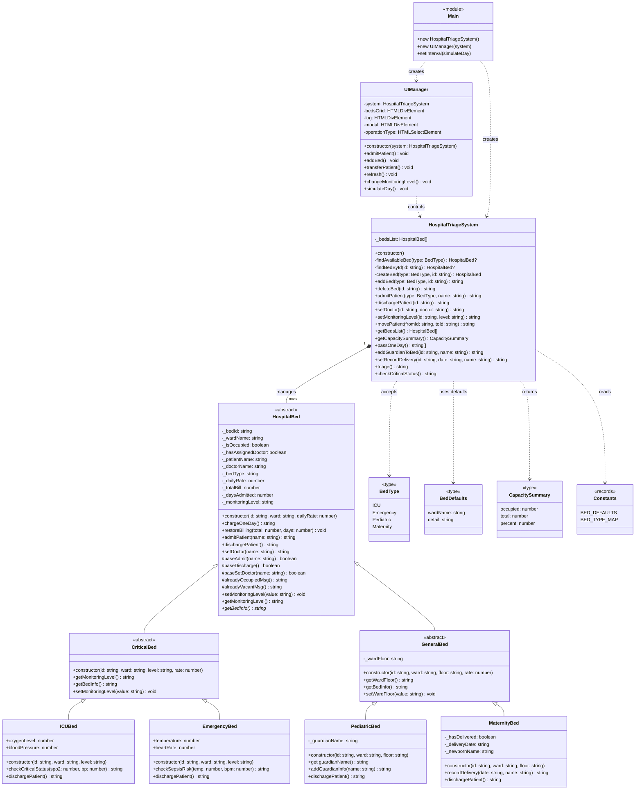

# UML2 Class Diagram

This diagram recreates the Hospital Bed Patient Triage System UML layout shown in the reference image.

## Visual Diagram

## Mermaid Diagram

```mermaid
classDiagram
    direction TB

    class UIManager {
        -system: HospitalTriageSystem
        -bedsGrid: HTMLDivElement
        -log: HTMLDivElement
        -modal: HTMLDivElement
        -operationType: HTMLSelectElement
        +constructor(system: HospitalTriageSystem)
        +admitPatient() void
        +addBed() void
        +transferPatient() void
        +refresh() void
        +changeMonitoringLevel() void
        +simulateDay() void
    }

    class Main {
        <<module>>
        +new HospitalTriageSystem()
        +new UIManager(system)
        +setInterval(simulateDay)
    }

    class HospitalTriageSystem {
        -_bedsList: HospitalBed[]
        +constructor()
        -findAvailableBed(type: BedType) HospitalBed?
        -findBedById(id: string) HospitalBed?
        -createBed(type: BedType, id: string) HospitalBed
        +addBed(type: BedType, id: string) string
        +deleteBed(id: string) string
        +admitPatient(type: BedType, name: string) string
        +dischargePatient(id: string) string
        +setDoctor(id: string, doctor: string) string
        +setMonitoringLevel(id: string, level: string) string
        +movePatient(fromId: string, toId: string) string
        +getBedsList() HospitalBed[]
        +getCapacitySummary() CapacitySummary
        +passOneDay() string[]
        +addGuardianToBed(id: string, name: string) string
        +setRecordDelivery(id: string, date: string, name: string) string
        +triage() string
        +checkCriticalStatus() string
    }

    class HospitalBed {
        <<abstract>>
        -_bedId: string
        -_wardName: string
        -_isOccupied: boolean
        -_hasAssignedDoctor: boolean
        -_patientName: string
        -_doctorName: string
        -_bedType: string
        -_dailyRate: number
        -_totalBill: number
        -_daysAdmitted: number
        -_monitoringLevel: string
        +constructor(id: string, ward: string, dailyRate: number)
        +chargeOneDay() string
        +restoreBilling(total: number, days: number) void
        +admitPatient(name: string) string
        +dischargePatient() string
        +setDoctor(name: string) string
        #baseAdmit(name: string) boolean
        #baseDischarge() boolean
        #baseSetDoctor(name: string) boolean
        #alreadyOccupiedMsg() string
        #alreadyVacantMsg() string
        +setMonitoringLevel(value: string) void
        +getMonitoringLevel() string
        +getBedInfo()* string
    }

    class CriticalBed {
        <<abstract>>
        +constructor(id: string, ward: string, level: string, rate: number)
        +getMonitoringLevel() string
        +getBedInfo() string
        +setMonitoringLevel(value: string) void
    }

    class GeneralBed {
        <<abstract>>
        -_wardFloor: string
        +constructor(id: string, ward: string, floor: string, rate: number)
        +getWardFloor() string
        +getBedInfo() string
        +setWardFloor(value: string) void
    }

    class ICUBed {
        +oxygenLevel: number
        +bloodPressure: number
        +constructor(id: string, ward: string, level: string)
        +checkCriticalStatus(spo2: number, bp: number) string
        +dischargePatient() string
    }

    class EmergencyBed {
        +temperature: number
        +heartRate: number
        +constructor(id: string, ward: string, level: string)
        +checkSepsisRisk(temp: number, bpm: number) string
        +dischargePatient() string
    }

    class PediatricBed {
        -_guardianName: string
        +constructor(id: string, ward: string, floor: string)
        +get guardianName() string
        +addGuardianInfo(name: string) string
        +dischargePatient() string
    }

    class MaternityBed {
        -_hasDelivered: boolean
        -_deliveryDate: string
        -_newbornName: string
        +constructor(id: string, ward: string, floor: string)
        +recordDelivery(date: string, name: string) string
        +dischargePatient() string
    }

    class BedType {
        <<type>>
        ICU
        Emergency
        Pediatric
        Maternity
    }

    class BedDefaults {
        <<type>>
        wardName: string
        detail: string
    }

    class CapacitySummary {
        <<type>>
        occupied: number
        total: number
        percent: number
    }

    class Constants {
        <<records>>
        BED_DEFAULTS
        BED_TYPE_MAP
    }

    HospitalBed <|-- CriticalBed
    HospitalBed <|-- GeneralBed
    CriticalBed <|-- ICUBed
    CriticalBed <|-- EmergencyBed
    GeneralBed <|-- PediatricBed
    GeneralBed <|-- MaternityBed
    UIManager ..> HospitalTriageSystem : controls
    Main ..> HospitalTriageSystem : creates
    Main ..> UIManager : creates
    HospitalTriageSystem "1" *-- "many" HospitalBed : manages
    HospitalTriageSystem ..> BedType : accepts
    HospitalTriageSystem ..> BedDefaults : uses defaults
    HospitalTriageSystem ..> CapacitySummary : returns
    HospitalTriageSystem ..> Constants : reads
```
